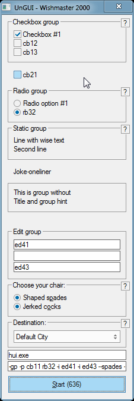
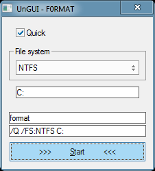

# UnGUI
INI-scriptable app for creating GUI for other apps :3

## Description
UnGUI — simple tool for creation GUI.

e.g. you have program with thousand keys and use olny 10 of them. So why contiue use cmd.exe instead of GUI? You are not linuxoid.
Here is solution — UnGUI.

## Screenshots

## Features
* various control types: edit, checkbox, combobox, radiobuttons, static text
* command line control
* embedded config
* drag'n'drop
* autosuggestion
* multilanguage GUI (in theory. You are welcome to commit your translation in config_to_embed.ini)

## Hot keys
* `Esc` — exit
* `F1` — UnGUI command line help
* `F2/F3` — opacity in/decrementation

## Command line
* `-c <file>` load Config from file
* `-t <0|1>` on Top
* `-l <abbr|code>` Language
* `-e <file>` Embed config in resources (UPX.exe needed to unpacking. And optionally for packing)

## Config format
UnGUI search for config as follows:
* in own cmdline (-c parameter)
* config.ini in working directory
* CONFIG/DEFAULT embedded resource

Config — simple INI file started with signature `UnGUI0` that differ configs among other files
As it's INI file, it have to contain sections. It is.
There are two types of sections:

**[options]** — contains general options as:
* `title` — will be part of program title
* `command` — that will be launched
* `on_top` — true or false
* `exit_after_launch` — true or false
* `timeout` — in seconds
* `opacity` — from 1 to 255

**[param_group_N]** — group of parameters (*N* — group number)
* `title` — group title
* `hint` — group hint (shows as "?" button)
* `type` — one of {checkbox, radio, static, edit, combobox}
* `group_prefix` — if group non-empty this one will be placed in front of group parameters
* `prefix` — if element non-empty this one will be placed in front of element value

(below *N* — element number)
* `value_N` — will be shown on element
* `key_N` — will be placed in cmdline field
* `default_N` — true of false
* `hint_N` — shown on mousehover on element

Both N-numerations should not have gaps. All sections/elements after gap will be ignored.
